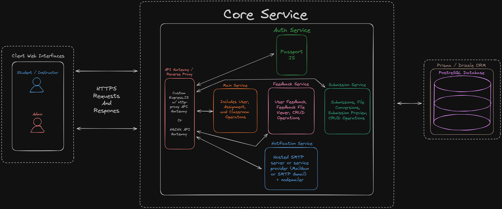
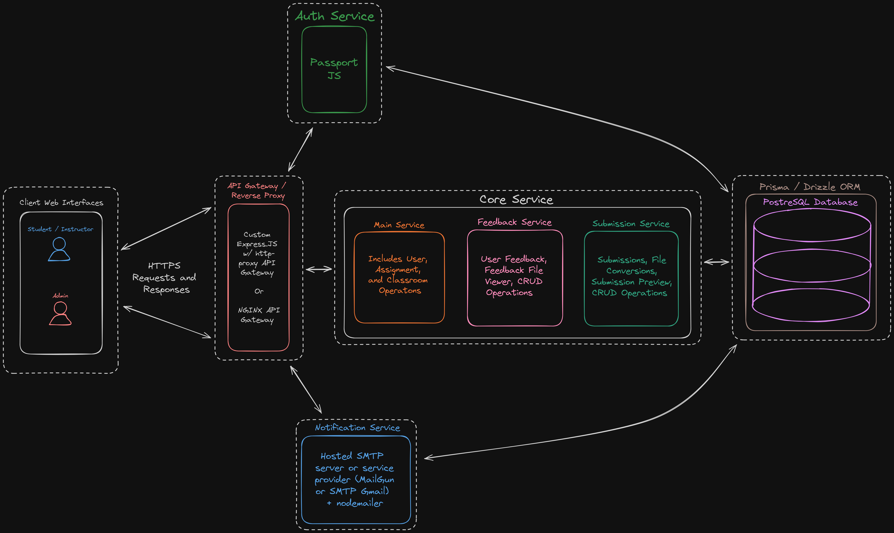
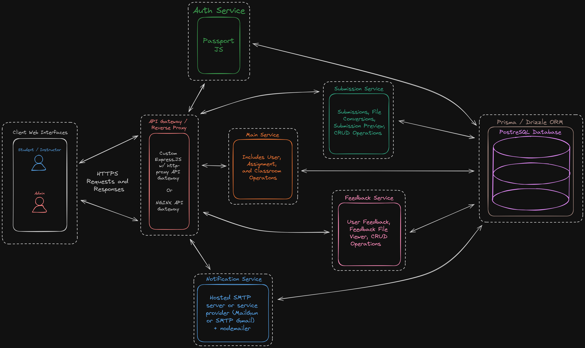

# System Design

## Introduction

Start with a brief introduction of **what** you are building, reminding the reader of the high-level usage scenarios (project purpose).   Complete each section with the required components.  Don't forget that you can include [images in your markdown](https://docs.github.com/en/get-started/writing-on-github/getting-started-with-writing-and-formatting-on-github/basic-writing-and-formatting-syntax#images).  

Start each section with a lead-in, detailing what it is.  Also, do not just have a collection of images.   Each diagram must be explained clearly. **Do not assume that the reader understands the intentions of your designs**.

## System Architecture Design 

For our Project, we will be applying a hybrid of the **Modular Monolith** and **Microservices** architecture patterns. Since we are not sure about the feasabilty or difficulty of a micro-services approach, we are going to start the development process with a standard 3-part architecture: **Front-end service, Back-end service, and a Database**. The Front-end service, or **Client Web Interfaces** will be a React based web-server which will serve front-end content and communicate with the back-end VIA api endpoints. The Back-end service, or the **Core Service Monolith** will provide all of the functionailites of the application and will be seperated into **modules**. These main modules/services are:

* The ***API Gateway / Reverse Proxy*** module...
* will facilitate communication between the client (**Front-end service**) and the backend services (**Core Service Monolith**). It will handle routing of requests to the appropriate modules and provide a single entry point for all client requests (may also load balance and rate limit). Additionally, it will manage authentication and authorization by directing these requests to the Authentication module.
* The ***Authentication*** module... 
    * will manage user login, registration, and authentication processes. It will handle JWT generation and validation (passport.js), ensuring secure access to the application's resources. It will also manage user roles and permissions, providing role-based access control to different parts of the **Core Service Monolith**. 
* The ***Notification*** module...
    * will be responsible for sending notifications to users. This will include email notifications for account verification, password reset, assignment dead-lines, and review updates. It will interface with an SMTP server or a third-party email service provider to send out these notifications.
* The ***Main*** module... (User, Assignment, and Classroom Operations)
    * will handle the core instructor and basic user functionalites. This module will manage user profiles, user group assignments, class creation and enrollment, and the creation and management of assignments.
* The ***Submission*** module...
    * will manage the process of students submitting assignments. This module will handle repeat submissions, various submission formats and restrict submissions to certian file-types. It will also manage the status of submissions and provide feedback to users on their submissions
* The ***Feedback*** module...
    * will handle the creation and management of feedback on assignment submissions. It will allow reviewers to provide comments and grades on submitted assignments. This module will ensure that feedback is stored and associated with the correct submission and user. 

Since the **Modular Monolith** approach doesn't have to consider isolated inter-service communication, a highly complex API gateway, or other complexities when developing a microservices application, it seems like the best approach to start for development (We can just start developing features on the back-end and begin splitting them into modules). As we continue, if we are making modules quickly, generally isolated, and not extremely overloaded nor complex, we may shift into more of a **Microservices** approach since they favor scalability and also relability (if one of your services goes down, the rest can still run).

:star: The dotted lines outside a service represent a docker container

## System Architecture Design: *Modular Monolith*

## System Architecture Design: *Modular Monolith w/ Microservices*

## System Architecture Design: *Microservices*

Recall the system architecture slides and tell us which architecture pattern you are using and why (it may also be something not in the slides or be a combination). Provide more details about the components you have written, and where these components fit in the overall architecture so we can visualize how you have decomposed your system. Basically, this should all be captured in ONE diagram with the components on them and a few sentences explaining (i) why you chose this architecture and (ii) why the components are where you put them. If you want to just focus on a certain aspect of your system and not show the entire architecture for your system in the diagram, that should be fine as well.

## Use Case Models

Extending from your requirements, the team will need to develop a set of usage scenarios for each user group documented as properly dressed use cases  (including diagrams following the UML syntax and descriptions as presented in class).   You may also want to include journey lines with some use cases. 

## Database Design 

Provide an ER diagram of the entities and relationships you anticipate having in your system (this will most likely change, but you need a starting point).  In a few sentences, explain why the data is modelled this way and what is the purpose of each table/attribute.  For this part, you only need to have ONE diagram and an explanation.

## Data Flow Diagram (Level 0/Level 1)

The team is required to create comprehensive Level 0 and Level 1 Data Flow Diagrams (DFDs) to visually represent the system’s data flow, including key processes, data stores, and data movements.  The deliverables will include a high-level context diagram, a detailed Level 1 DFD, and supporting documentation to facilitate the understanding of data movement within the system.   Remember that within a L1 DFD, the same general level of abstraction should apply to all processes (review 310 notes for guidance),

## User Interface (UI) Design

The team is required to put forward a series of UI mock-ups that will be used as starting points for the design of the system   They can be minimal but the team will need to  have at least made some choices about the interaction flow of the application.  You should consider the different major aspects of user interactions and develop UI mockups for those (think about the different features/use cases and what pages are needed; you will have a number most likely).  Additionally, create a diagram to explain the navigation flow for the MVP  prototype (and any alternate flows).  When considering your UI, think about usability, accessibility, desktop and mobile uses.  As a team, you will need to discuss design choices for the system.
